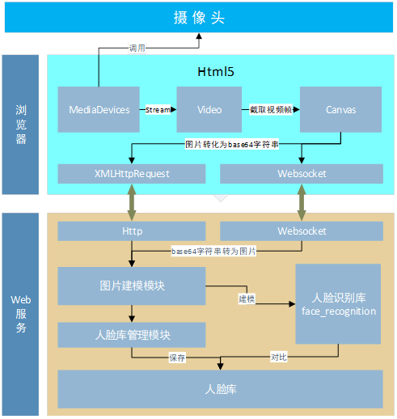

# face_rec
使用h5调用摄像头+face_recognition实现人脸识别服务

安装步骤：
1. 先安装开发环境 python37
2. 安装依赖 如果使用虚拟环境管理工具pipenv，运行 pipenv install 
3. 安装成功后 运行 pipenv run app 或者 python app.py
4. 使用chrome或者firefox浏览器 访问：http://127.0.0.1:8000/static/index.html

安装人脸识别库face_recognition有坑请移步 访问 [安装 face-recognition](https://github.com/James-Nie/face_rec/blob/master/README1.md)

由于浏览器调用摄像头需要在https协议或127.0.0.1或localhost下才有权限，如果想用其他电脑访问开发环境，使用以下方法
chrome 启动快捷键后加上以下后缀：
-no-sandbox --unsafely-treat-insecure-origin-as-secure="http://ip:8000"

5. 模块图

6. 时序图

